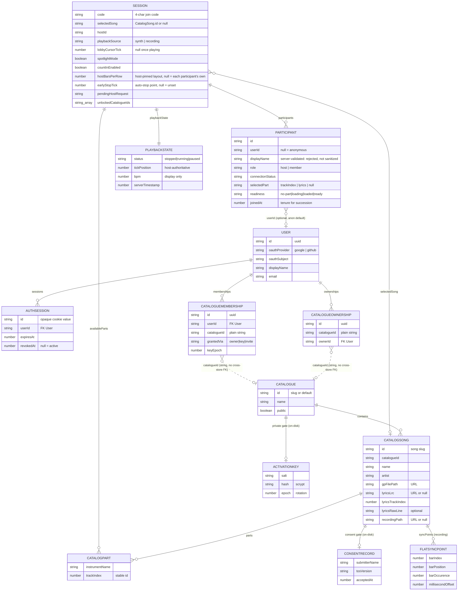
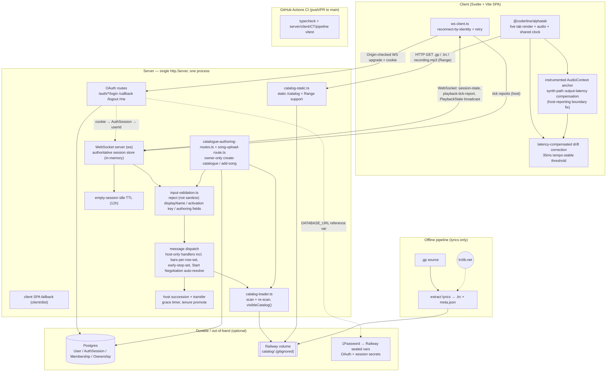
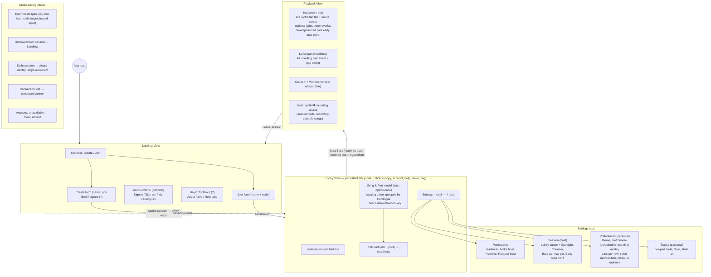

# sync-tab-scroll

<!-- ardd-badge-start -->
<p align="center">
  <a href="https://github.com/kinda-bad/sync-tab-scroll/actions/workflows/ci.yml"></a>
  <a href="https://github.com/kinda-bad/sync-tab-scroll/commits/main"></a>
  <a href="https://github.com/moui72/artifact-driven-dev"></a>
  <a href="https://github.com/moui72/artifact-driven-dev"></a>
  <a href="https://www.alphatab.net/"></a>
</p>
<!-- ardd-badge-end -->

<p align="center">
  <a href="https://github.com/sponsors/moui72"></a>
</p>

A synchronized tab-scrolling app for musicians playing together remotely.
See `.project/artifacts/` for the full artifact-driven-dev specification
(`constitution.md`, `datamodel.md`, `pipeline.md`, `infrastructure.md`,
`ui.md`, `brand.md`) and `.project/STATUS.md` for current status.

## Getting Started

### Prerequisites and install

Requires Node **>=22** (per root `package.json`'s `engines` field) and
[pnpm](https://pnpm.io/) (tested with pnpm 10.33.0). From the repo root:

```sh
pnpm install
```

This installs all workspace packages (`client`, `server`,
`packages/pipeline`, `packages/shared`) and sets `core.hooksPath` to
`.githooks` via the `prepare` script.

### Configuration (`.env`)

Both `server/` and `client/` need a local `.env`, copied from their
`.env.example`:

```sh
cp server/.env.example server/.env
cp client/.env.example client/.env
```

Per constitution Principle VIII, `server/.env`'s `PORT` and
`client/.env`'s `VITE_BACKEND_PORT` must stay equal — both encode the dev
backend port that the client's `/catalog` proxy and WebSocket connection
target (default `6080` in both `.env.example` files). If they drift, the
client's dev server silently proxies `/catalog` and WS traffic at the
wrong backend, with no error. `.env` is git-ignored; a
`pnpm check:env` script (run automatically before commit) checks that
each `.env` has the same key set as its `.env.example`, but does not
check that the port *values* match — that part is on you.

### Running the dev servers

```sh
pnpm dev
```

runs `pnpm -r --parallel dev`, starting both the server
(`tsx watch`, listening on `server/.env`'s `PORT`, default `6080`) and the
client (Vite dev server, hardcoded to port `6100` in
`client/vite.config.ts`) together.

**Why 6100, not 6000:** Chrome (and other Chromium browsers) refuses to
navigate to port 6000 at all — it's hardcoded on their list of restricted
"unsafe" ports (historically associated with the X11 window system), a
browser restriction with no override, not a bug in this app. 6100 was
chosen specifically to avoid it — if you ever point the client dev server
at a different port yourself, check it against
[Chromium's unsafe-ports list](https://chromium.googlesource.com/chromium/src/+/main/net/base/port_util.cc)
first.

## Adding a song

The `packages/pipeline` workspace has a CLI, `extract-lyrics`, that
converts a Guitar Pro (`.gp`) file into a catalog entry. From the repo
root:

```sh
pnpm --filter @sync-tab-scroll/pipeline extract-lyrics <path-to-file.gp> <catalogRoot>
```

For example, verified against a real `.gp` file:

```sh
pnpm --filter @sync-tab-scroll/pipeline extract-lyrics \
  /path/to/Radiohead-Creep-06-25-2026.gp \
  ./catalog
```

**Note:** `pnpm --filter <pkg> <script>` runs the script with its
working directory set to that package (`packages/pipeline/`), so a
relative `<catalogRoot>` like `./catalog` resolves *inside
`packages/pipeline/`*, not at the repo root — pass an absolute path (or
one relative to `packages/pipeline/`) if you want the catalog to land
elsewhere, e.g. the repo-root `catalog/` directory that `server/.env`'s
`CATALOG_ROOT` points at by default.

This produces a new `<catalogRoot>/<song-slug>/` directory (the slug is
derived from artist/title) containing:
- the published `.gp` file itself,
- `meta.json` (song name, artist, per-track `parts`, and lyrics-sync
  fields — `lyricsTrackIndex`, `lyricsLineIndex`, `lyricLineBreaks`),
- `lyrics.lrc`, if lyrics were found on the designated lyrics track (or
  via the lrclib.net fallback — see `pipeline.md`).

The server picks up everything under its `CATALOG_ROOT` at startup.

If you're running a public deployment with `REQUIRE_SONG_CONSENT=true`,
each song directory also needs a consent record before the server will
load it — record one with:

```sh
pnpm --filter @sync-tab-scroll/pipeline record-consent <catalogRoot> <songSlug> <submitterName>
```

See `.project/artifacts/datamodel.md`'s Consent Record section for the
full field list and rationale; this isn't needed for local/personal
catalog use.

## Running tests

| Suite | Command | Working directory |
|-------|---------|--------------------|
| Server unit tests (vitest) | `pnpm test` | `server/` |
| Client unit tests (vitest) | `pnpm test` | `client/` |
| Client component tests (Playwright CT) | `pnpm test:ct` | `client/` |
| Client end-to-end tests (Playwright) | `pnpm test:e2e` | `client/` |

All four were run clean in this worktree: 88 server tests, 61 client
unit tests, 79 CT tests, and 23 e2e tests, all passing. The e2e suite
builds the client and starts its own server/client instances on
alternate ports (see `client/playwright.config.ts`), so it doesn't
collide with a `pnpm dev` session you already have running.

## Deploying to Railway

The system deploys as a single [Railway](https://railway.app/) service:
one container runs the server, which serves the built client SPA, the
song catalog, and the WebSocket upgrade all on one port (see
`.project/artifacts/infrastructure.md`'s "Deployment (Railway +
Terraform)" section for the full design). Infrastructure is provisioned
with Terraform (`infra/`), not through Railway's dashboard.

This is a **manual, one-time setup an operator runs themselves** — no
part of this repo's tooling or CI ever runs `terraform apply`
automatically:

1. Create a [Railway](https://railway.app/) account and generate an
   **account API token** at
   [railway.com/account/tokens](https://railway.com/account/tokens). It
   must be an account (or team/workspace) token — a *project-scoped* token
   can't create the project and will fail with `projectCreate ... Not
   Authorized`.
2. Set the target workspace. Railway's `projectCreate` requires an explicit
   workspace ID even for a personal workspace. The `workspace_id` variable
   in `infra/variables.tf` is defaulted to this deployment's workspace; to
   deploy into a different one, find its ID (query `me { workspaces { id
   name } }` against `https://backboard.railway.com/graphql/v2` with your
   token, or read it from the dashboard URL) and pass it as
   `TF_VAR_workspace_id`.
3. From `infra/`:
   ```sh
   export RAILWAY_TOKEN=<your account token>
   terraform init
   terraform plan
   ```
4. **Review the plan output carefully** — it provisions real, billable
   Railway resources (a project, a service built from this repo's
   `Dockerfile`, a persistent volume for catalog content, and service
   environment variables) under your own account.
5. If it looks right:
   ```sh
   terraform apply
   ```

After provisioning, the catalog volume is empty — populate it the same
way a local/personal deployment's `catalog/` directory is populated (see
"Adding a song," above): each song gets its own `catalog/<song-slug>/`
directory containing its `.gp`/`.lrc`/`meta.json`. There's no upload
mechanism or web form; content reaches the volume the same
operator-driven, offline way it always has (`.project/artifacts/
pipeline.md`). The deployed service also runs with
`REQUIRE_SONG_CONSENT=true` by default (unlike a local deployment's
`false` default) — see `.project/artifacts/datamodel.md`'s Consent
Record section for what that requires per song.

A Railway volume has no upload UI, so content reaches it by streaming a
tarball over `railway ssh` into the mount path (`/data/catalog`).
**On macOS, disable AppleDouble metadata in the tar** — otherwise the OS
writes a `._<name>` xattr sidecar for every file, and a `._Song.gp`
companion gets picked up as a bogus (unparseable) tab, breaking rendering
on the deployed app:

```sh
# From the repo root, with the Railway CLI logged in and the service linked:
COPYFILE_DISABLE=1 tar czf - -C catalog . \
  | railway ssh "mkdir -p /data/catalog && tar xzf - -C /data/catalog"
railway redeploy   # the server scans the catalog only at startup
```

(`COPYFILE_DISABLE=1` is the macOS-specific guard; `--no-mac-metadata` or
`--exclude='._*'` work too. The server also defensively ignores `._*`
sidecars when selecting a song's `.gp`, but keeping them off the volume in
the first place is cleaner.)

See `infra/README.md` for the Terraform provider and state-management
tradeoffs this config makes.

## Datamodel



## Infrastructure



## UI



## Acknowledgements

This app's tab rendering, playback, and cursor sync are all built on
[alphaTab](https://www.alphatab.net/), an excellent open-source music
notation and Guitar Pro rendering engine. Thank you to the alphaTab
maintainers and contributors — this project wouldn't exist without it.

