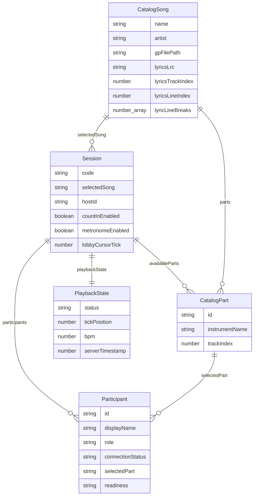
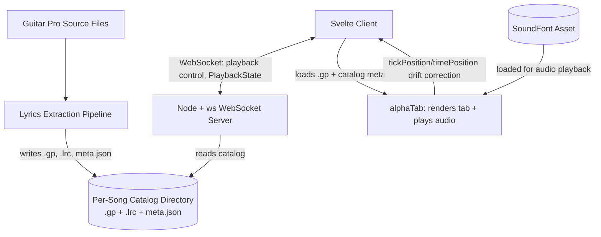
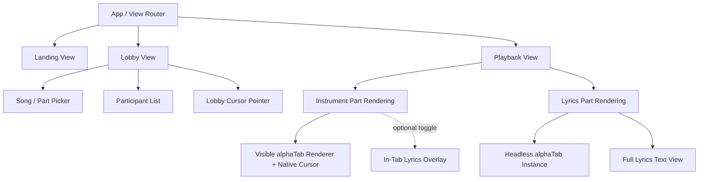

# sync-tab-scroll

A synchronized tab-scrolling app for musicians playing together remotely.
See `.project/artifacts/` for the full artifact-driven-dev specification
(`constitution.md`, `datamodel.md`, `pipeline.md`, `infrastructure.md`,
`ui.md`, `brand.md`) and `.project/STATUS.md` for current status.

## Datamodel

## Infrastructure

## UI

